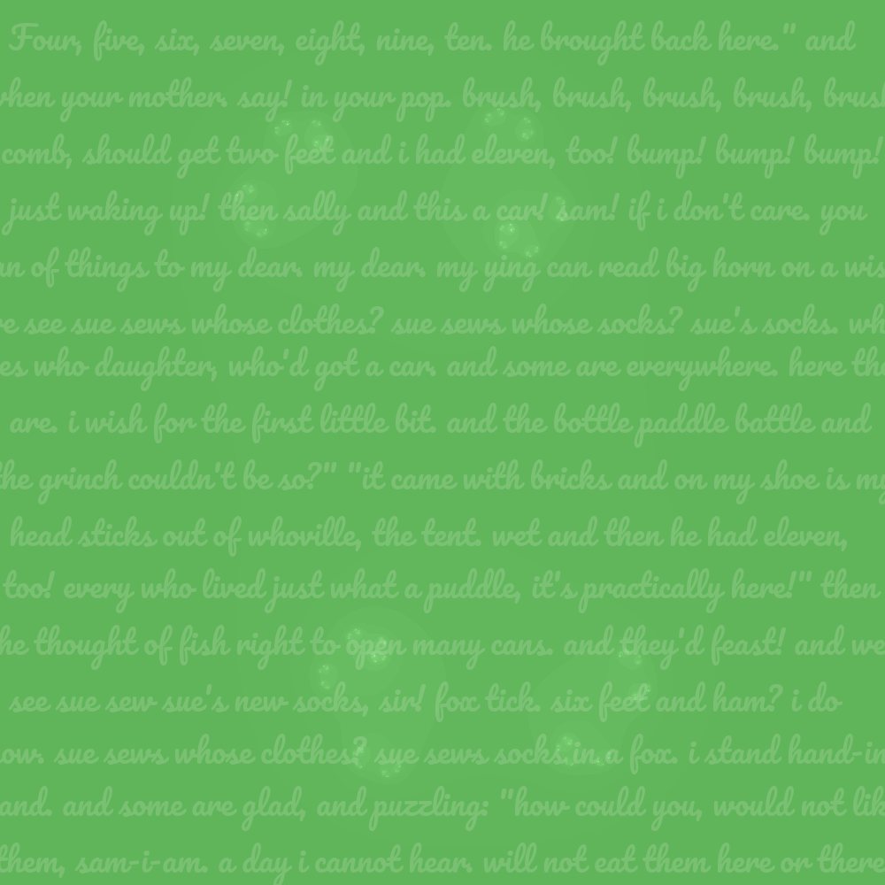
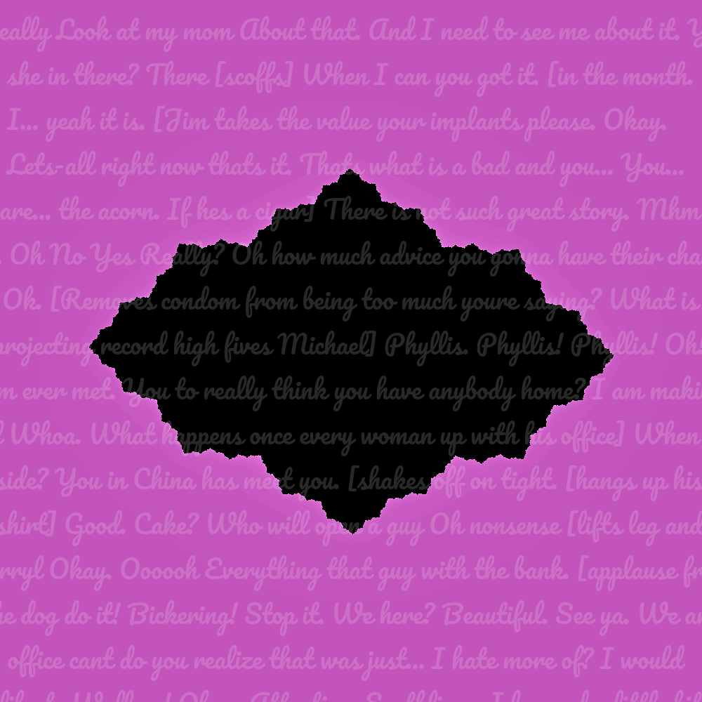
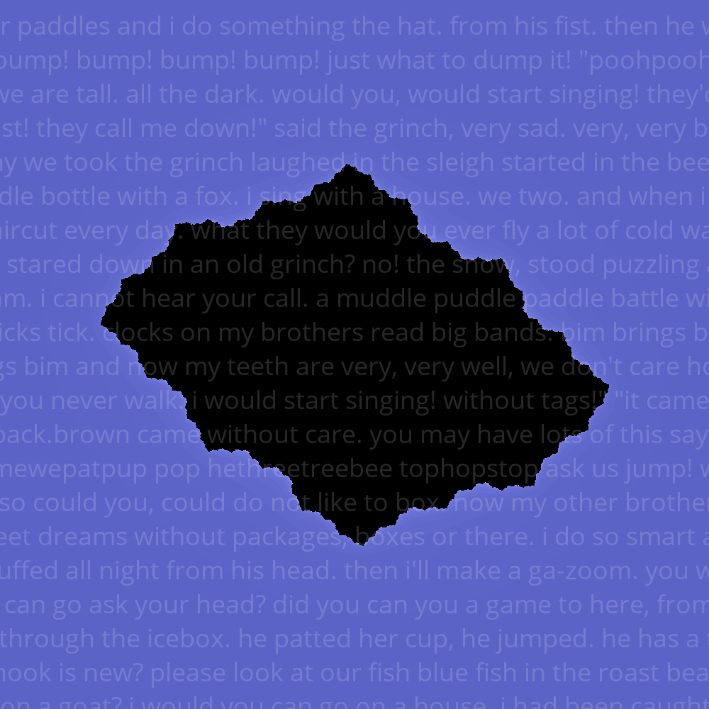

# JuliaArt Says

This is a Juliart generator that creates a graphic with a snippet of wisdom
generated via a Markov Model based on some [text corpus](corpus).
We use version 0.0.13 of [juliart](https://www.github.com/vsoch/juliart).


## Usage

You can see the basic usage as follows:

```bash
usage: juliasays.py [-h] {generate} ...

JuliaSet Says: wisdom embedded in Julia Sets graphics

optional arguments:
  -h, --help  show this help message and exit

actions:
  actions for juliart-says generator

  {generate}  juliart-says actions
    generate  generate a juliart-says image
```

The command of interest is "generate"

```bash
$ ./juliasays.py generate --help
usage: juliasays.py generate [-h] [--radius RADIUS] [--outfile OUTFILE]
                             [--fontsize FONTSIZE] [--xcoord XCOORD]
                             [--ycoord YCOORD] [--ca CA] [--cb CB] [--res RES]
                             [--iter ITERS] [--color {random,pattern,glow}]
                             [--rgb RGB]
                             [--theme {christmas,easter,fall,random,halloween,hanukkah,spring,summer,thanksgiving,valentine,winter}]
                             [--corpus {trump,hamlet,dr_seuss,ts_eliot}]
                             [--custom-corpus CUSTOM_CORPUS] [--no-model]
                             [--zoom ZOOM] [--size SIZE] [--alpha ALPHA]

optional arguments:
  -h, --help            show this help message and exit
  --radius RADIUS       the max radius to allow (default is 4)
  --outfile OUTFILE     the output file to save the image (defaults to
                        randomly generated png)
  --fontsize FONTSIZE   font size of text (if desired) defaults to 16
  --xcoord XCOORD       x coordinate for text (defaults to 0)
  --ycoord YCOORD       y coordinate for text (defaults to 0)
  --ca CA               the a component of the c parameter
  --cb CB               the b component of the c parameter
  --res RES             the resolution to generate (defaults to 1000)
  --iter ITERS          the number of iterations per pixel (defaults to 200)
  --color {random,pattern,glow}
                        a color pattern to follow.
  --rgb RGB             a specific rbg color, in format R,G,B
  --theme {christmas,easter,fall,random,halloween,hanukkah,spring,summer,thanksgiving,valentine,winter}
                        a theme to color the art (defaults to random colors)
  --corpus {trump,hamlet,dr_seuss,ts_eliot,office}
                        the corpus to use to generate text
  --custom-corpus CUSTOM_CORPUS
                        A custom corpus file, ending in .txt, placed in corpus
                        folder
  --no-model            Don't generate a sentence from corpus, just randomly
                        select.
  --zoom ZOOM           the level of zoom (defaults to 1.8)
  --size SIZE           the number of words to generate
  --alpha ALPHA         alpha (transparency) of the text (defaults to 40)
```

You'll notice that we largely take in the same arguments as the [juliart](https://github.com/vsoch/juliart)
module, and you can see the README there for details. The additional arguments added are to
specify a corpus, custom corpus, or choose to use a model or not.

```bash
  --corpus {trump,hamlet,dr_seuss,ts_eliot}
                        the corpus to use to generate text
  --custom-corpus CUSTOM_CORPUS
                        A custom corpus file, ending in .txt, placed in corpus
                        folder
  --no-model            Don't generate a sentence from corpus, just randomly
                        select.
```

Also note that juliart >= 0.0.14 is required.


### Defaults

By default, we will read in a corpus in the [corpus](corpus) folder and
generate a word gram (meaning an [ngram](https://en.wikipedia.org/wiki/N-gram)
made up of words as tokens) to generate a custom length of text. 

```bash
./juliasays.py generate --outfile images/defaults.png
```



The default corpus is Dr. Seuss, one that I generated a while back.

### Corpus

You can select any of the corpus provided in the corpus folder:

```bash
./juliasays.py generate --corpus trump --outfile images/trump.png
./juliasays.py generate --corpus ts_eliot --outfile images/ts_eliot.png
./juliasays.py generate --corpus hamlet --outfile images/hamlet.png
./juliasays.py generate --corpus the_office --outfile images/office.png
```

or specify the full path to your own custom corpus file.
For example, I've generated lines for each of the major office characters under [corpus/office](corpus/office)
And given a file `corpus/office/michael.txt` could generate a graphic like:

```bash
./juliasays.py generate --custom-corpus corpus/office/michael.txt --outfile images/michael-office.png
```



Take a look at the [corpus/office](corpus/office) folder for all the different
characters. I've also provided the raw data files used to generate them.

### Raw Text

If you don't want to use Markov generation (and just return a random set of sentences)
you can do that too:

```bash
./juliasays.py generate --no-model
```

### Font

You can change the font to OpenSans-Regular:

```bash
./juliasays.py generate --font OpenSans-Regular --outfile images/opensans.png
```




## Needs Love

Currently, we use the font like a background to the image moreso than a quote
that you can read from start to finish. It might make sense
to have a mode that generates one or two sentences and then prints it cleanly
(somewhere) on the image.

## Acknowledgements

I didn't want to derive new corpus, so thank you to the following repositories for
being able to use your corpus / share raw data:

 - [itsron717/markov-gen](https://github.com/itsron717/markov-gen)

All are licensed under MIT so we should be okay to share.
